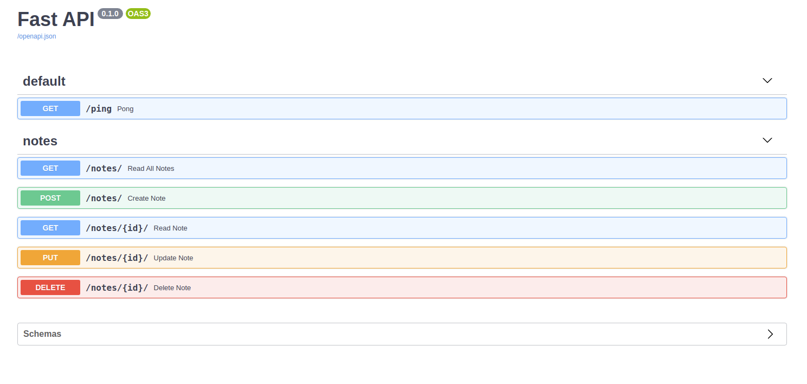

<p align="center">
  

  <a href="https://github.com/kaiomagri/fastapi_crud">
    
  </a>

  

  <a href="https://github.com/kaiomagri/fastapi_crud">
    
  </a>
</p>

# Developing and Testing an Asynchronous API with FastAPI and Pytest

This tutorial looks at how to develop and test an asynchronous API with FastAPI, Postgres, Pytest, and Docker using Test-Driven Development (TDD). We'll also use the Databases package for interacting with Postgres asynchronously.

- [Tutorial Website](https://testdriven.io/blog/fastapi-crud/)

##Dependencies:

* FastAPI v0.46.0
* Docker v19.03.5
* Python v3.8.1
* Pytest v5.3.2
* Databases v0.2.6

###Objectives
####By the end of this post you should be able to:

- Develop an asynchronous RESTful API with Python and FastAPI
- Practice Test-Driven Development
- Test a FastAPI app with Pytest
- Interact with a Postgres database asynchronously
- Containerize FastAPI and Postgres inside a Docker container
- Parameterize test functions and mock functionality in tests with Pytest
- Document a RESTful API with Swagger/OpenAPI

## How to Run

The application run inside a docker container using images for python and postgresql.

- 1º You can build the docker container

```bash
docker-compose up -d --build
```

- 2º Check if the database '' was created with psql

```bash
$ docker-compose exec db psql --username=hello_fastapi --dbname=hello_fastapi_dev

psql (12.1)
Type "help" for help.

hello_fastapi_dev=# \l
                                            List of databases
       Name        |     Owner     | Encoding |  Collate   |   Ctype    |        Access privileges
-------------------+---------------+----------+------------+------------+---------------------------------
 hello_fastapi_dev | hello_fastapi | UTF8     | en_US.utf8 | en_US.utf8 |
 postgres          | hello_fastapi | UTF8     | en_US.utf8 | en_US.utf8 |
 template0         | hello_fastapi | UTF8     | en_US.utf8 | en_US.utf8 | =c/hello_fastapi               +
                   |               |          |            |            | hello_fastapi=CTc/hello_fastapi
 template1         | hello_fastapi | UTF8     | en_US.utf8 | en_US.utf8 | =c/hello_fastapi               +
                   |               |          |            |            | hello_fastapi=CTc/hello_fastapi
(4 rows)

hello_fastapi_dev=# \c hello_fastapi_dev
You are now connected to database "hello_fastapi_dev" as user "hello_fastapi".

hello_fastapi_dev=# \dt
           List of relations
 Schema | Name  | Type  |     Owner
--------+-------+-------+---------------
 public | notes | table | hello_fastapi
(1 row)

hello_fastapi_dev=# \q
```
- 3º Run the pytest inside de root dir to check the app.
```bash
docker-compose exec web pytest .
==================================================================================== test session starts =====================================================================================
platform linux -- Python 3.8.1, pytest-5.3.2, py-1.9.0, pluggy-0.13.1
rootdir: /usr/src/app
collected 15 items                                                                                                                                                                           

tests/test_notes.py ..............                                                                                                                                                     [ 93%]
tests/test_ping.py .                                                                                                                                                                   [100%]

===================================================================================== 15 passed in 0.07s =====================================================================================
```
- Now you can access the local: http://localhost:8002/docs